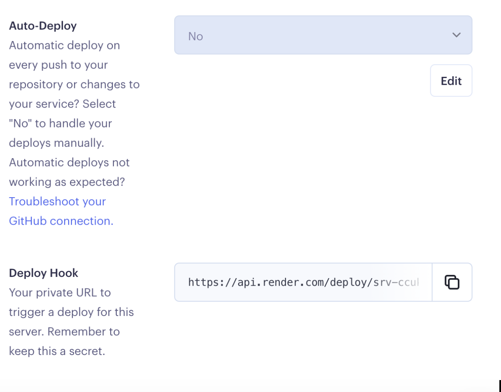

Continuous Integration using GitHub Actions
==============
Continuous Integration and Continuous Deployment Recitation

Changelog
==============
1. Implementation of a bowling score card.
2. Reference for Unit Testing lab for FSE Fall 2015 at CMU-SV.
3. Updated for CircleCI Integration for FSE Spring 2018 at CMU-SV.
4. Updated for CI/CD recitation for FSE Spring 2019 at CMU-SV.
5. Updated for CI/CD recitation for FSE Fall 2019 at CMU-SV.
6. Change the testing framework from Mocha to Jest for FSE Fall 2020 at CMU-SV.
7. Add eslint and mongodb image for FSE Fall 2020 at CMU-SV.
8. Removed mongodb image, and changed cache to "package-lock.json" for FSE Spring 2021 at CMU-SV.
9. Removed legacy code-climate for FSE Fall 2021 at CMU-SV

Install
==============
Install needed tools:
```
npm install
```

Tests results
==============
```
npm run test
```

Coverage results
==============
```
npm run coverage
```

Set up Render
================

1. Follow the steps to create a Web Service on Render
["Free Web Service"](https://render.com/docs/free).

2. On Render. Go to your `Web Service -> Setting -> Build and Deploy`. Set Auto-Deploy to No and copy Deploy Hook for Github Actions config. 



